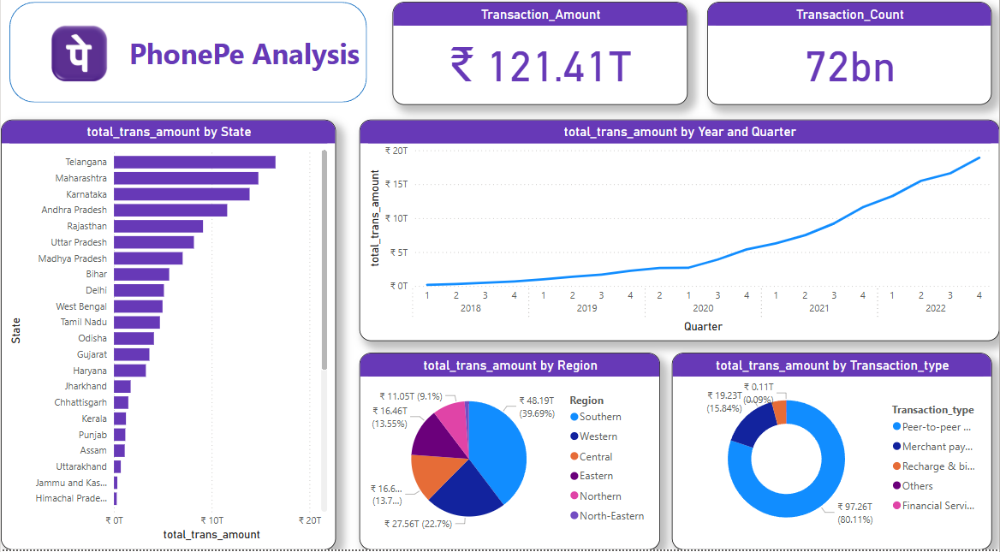

# DASHBOARD-DEVELOPMENT

*COMPANY*: CODTECH IT SOLUTIONS

*NAME*: PABITRA SAHOO

*INTERN ID*: CT04DF1804

*DOMAIN*: DATA ANALYST

*DURATION*: 4 WEEKS

*MENTOR*: NEELA SANTOSH

## TASK DESCRIPTION

 📌 Project Overview

PhonePe is a leading digital payments platform in India. This project analyzes PhonePe transaction data from 2018 to 2022 using Power BI. The goal is to identify trends across states, regions, transaction types, and time.

---

 📁 Dataset Description

- **Time Period:** 2018 to 2022 (quarterly data)
- **Fields Include:**
  - Transaction amount
  - Transaction count
  - Transaction type (P2P, Merchant Payments, etc.)
  - State & region
  - Year and quarter

---

 🛠️ Data Processing in Power BI

- Imported and cleaned data using Power Query
- Created calculated columns and measures using DAX
- Built interactive visuals:
- Total transactions (amount & count)
- Transactions by state, year/quarter, region, and type

## 🖼️ Dashboard Preview

---

## 🔍 Key Insights

- **Top States by Transactions:**  
  Karnataka, Maharashtra, Telangana, Andhra Pradesh, and Rajasthan had the highest total transaction amounts.

- **Steady Growth Over Years:**  
  PhonePe’s transactions increased consistently from 2018 to 2022. Growth was especially sharp during and after the pandemic.

- **Most Common Transaction Type:**  
  Peer-to-peer (P2P) transfers made up the largest share of transactions.

- **Merchant Payments Growing Fast:**  
  Payments to merchants also grew rapidly, showing more people are using PhonePe for shopping and bills.

- **Regional Patterns:**  
  Southern and Western states dominated in transaction volume compared to other regions.

 
  
